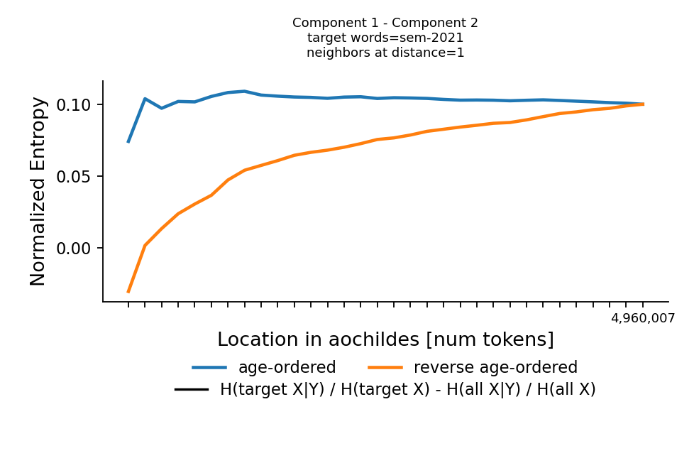
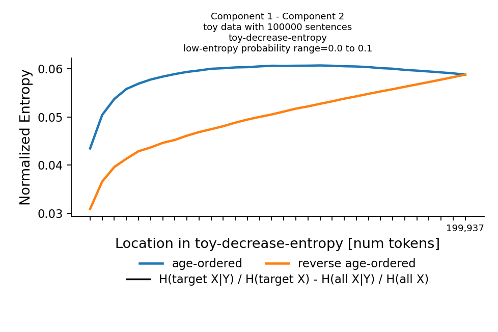

  

A simple Python class for working with sequences of artificial grammar.

## About

This repository contains two Python classes that instantiate two different artificial grammars. 
They are primarily for answering simple questions that come up during research in NLP and psycholinguistics,
such as:

1. How do the statistics of a corpus change when the vocabulary increases as more sequences are sampled?

A simple script is provided that plots an information-theoretic quantity I find useful in my work, 
and which I think has the potential to explain why it might be better to train NLP models on language data in a particular order. 

### Capturing how information changes across AOCHILDES using a toy corpus

AOCHILDES, a corpus of age-ordered transcribed speech to children, starts "entropic", which can be verified by plotting the cumulative conditional entropy of nouns given their right neighbors,
controlling for any change in cumulative conditional entropy of all words (component 2):

This same pattern can be re-capitulated in an artificial corpus in which less entropic right-neighbors are gradually introduced:
 

